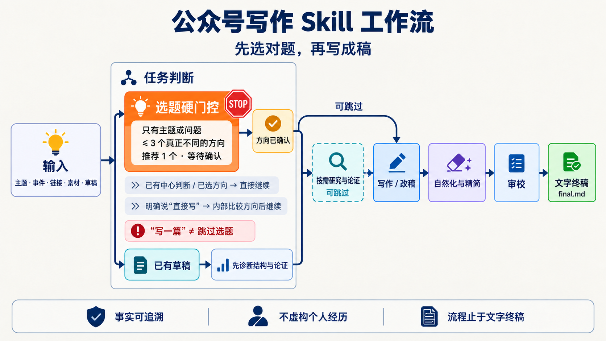

# 写作流程 v2

一套只负责文字创作的轻量公众号写作 Skill。它把主题、链接、零散素材或已有草稿推进为文字终稿，不要求每篇文章走完一套固定阶段，也不把内部流程暴露给对话。



## 这个 Skill 做什么

- **选题与方向**：从一个主题种子出发，找到值得写的问题，而不是把同一个主题换成几个标题。
- **按需研究**：只在事实、时效性或风险需要时核实，并让主张与证据一一对应。
- **成稿**：围绕文章的核心任务组织材料，重要内容讲透，次要内容点到为止。
- **自然化与精简**：每篇完整新稿和全文改稿都必须去除机器模式、空话与重复。
- **改稿与审校**：对旧稿先诊断再修改，对终稿做 brief、事实、论证、结构和语言检查。
- **风格学习**：从范文和作者本人的修改中提炼可复用的长期偏好。

## 这个 Skill 不做什么

- 不编造作者经历、朋友、采访、对话、数据、引语、来源或现场细节。
- 不套固定爆款公式，不追求固定字数，不为填满结构制造对称的三点式。
- 不承担成稿后的排版、配图、发布或分发；流程终点是文字终稿 `final.md`。

## 目录结构

```text
wechat-writing/            Skill 本体，只保存通用方法
├── SKILL.md               入口：判断当前请求应交由哪个方法
├── agents/openai.yaml     展示名与默认提示
├── assets/                可复制的作者档案、风格经验和文章 brief 模板
└── references/            按需加载的具体方法，含工作区与恢复契约
workspace/                 私有作者档案、样本、文章项目
├── author-profile.md      作者档案（从 Skill 的 assets 模板复制）
├── style-lessons.md       风格经验库（从 Skill 的 assets 模板复制）
├── writing-samples/       作者本人的代表文章
├── active-article.md      当前跨轮文章及工作文件的相对路径
└── articles/              需要保存或跨轮继续的文章
```

`workspace/articles/` 用于需要落盘的文章；普通单轮写作可以直接在聊天中完成，不必创建目录。`workspace/writing-samples/` 可以放作者本人的代表文章，供风格学习使用。这两个目录被 `.gitignore` 排除，克隆后并不存在，会在需要时按需创建。

## 快速开始

1. 将 `wechat-writing/assets/author-profile.template.md` 复制为 `workspace/author-profile.md`，按需填写账号、声音和内容边界。
2. 将 `wechat-writing/assets/style-lessons.template.md` 复制为 `workspace/style-lessons.md`，作为风格经验的沉淀表。
3. 直接向 Skill 提需求即可，不必预先填完所有档案——只有会影响长期写作决策的信息才值得写进去。

真实作者档案、文章和写作样本已被 `.gitignore` 排除，不应提交到公开仓库。

## 使用示例

**选题与方向**

- “我想写一篇关于 AI 让人越来越不敢表达的文章，先帮我找方向。”
- “今天写点什么？最近总看到‘年轻人不爱社交’的说法。”
- “某档喜剧节目快开播了，为什么现在的喜剧越来越以 sketch 为主？”

**直接成稿**

- “就按你推荐的方向直接写，目标读者是普通职场人。”
- “不要给方向，直接把这篇链接里的内容整理成一篇公众号文章。”

**改稿与审校**

- “检查这篇稿子，重点看事实边界和读者会不会中途掉线。”
- “这版太像 AI 写的，帮我改得自然一些，但别动事实和立场。”
- “只做校对，查错别字和事实问题。”

**风格与延续**

- “比较我改过的版本，记住可复用的写作偏好。”
- “继续上次那篇文章。”

## 工作流

```text
定任务或方向 → 最小 brief → 按需研究与论证 → 写作或改稿 → 自然化与精简 → 审校 → 终稿
```

- **定任务或方向**：明确文章要解释、主张、指导、比较、复盘还是表达；只有争议性文章才必须形成可反驳的中心论点。
- **最小 brief**：锁定读者问题、核心判断、新增价值、竞争解释、边界和待核实主张。
- **按需研究**：只有时效性事实、外部数据、引语、产品能力、政策规则或高风险判断需要核实时才研究。纯随笔、用户亲历和明确标注的个人判断可以不建来源账本。
- **写作**：围绕核心任务组织材料；每节只承担一个主要推进，评论和分析形成有边界的中心判断。
- **自然化与精简**：删除空话、重复、公式句和不承重的解释，不虚构“人味”。
- **审校**：旧稿先诊断再修改；终检先查事实和论证，再查读者理解，最后做最小语言调整。
- **终稿**：标题必须由正文兑现；终稿不夹带研究卡、审稿表或工作说明。

## 默认行为

- 新主题、事件、现象或研究问题只要还没有中心判断，就必须先给出最多 3 个真正不同的方向，推荐其中 1 个并等待选择。
- 具体问题和“为什么”“探讨一下”“写一篇”等措辞不等于选题已经确定。
- 用户给出可直接论证的中心判断，或选择了此前的方向后，才直接写作，不强制重复讨论流程。
- 方向确认后先形成最小 brief，研究和正文都必须服从它。
- 研究只在事实、时效性或风险需要时触发。
- 事实检查会先核验来源和时效，再进入审校，不把核查自动扩成全文重写。
- 用户明确说“直接写”“不要给方向”或“无需确认”时，内部先完成一次轻量方向比较，不额外打断用户；普通的“写一篇”不会跳过选题。
- 普通“润色一下”默认只改善表达并保留内容，不扩大成全文改稿。
- 完整新稿和全文改稿必须按“结构与内容 → 自然化与精简 → 终检”各执行一次。
- 重要机制和关键反方讲透；常识背景、重复例子和无关延伸不详细展开。
- 默认只交付成稿和少量必须由作者决定的问题，不输出冗长流程说明。
- 一次只询问一个会实质改变结果、且无法从上下文推断的问题。
- `final.md` 是流程终点，不继续执行任何成稿后制作或分发动作。

## 方法参考

入口只判断当前任务需要读什么，具体方法放在 `wechat-writing/references/` 中按需使用，不一次性加载全部规则：

| 参考 | 何时使用 | 解决的问题 |
|---|---|---|
| `ideation.md` | 新主题、链接、热点、现象或研究问题尚无中心判断 | 主题种子怎样形成真正不同的写作方向，并通过材料、问题、论点、读者四道门 |
| `research.md` | 事实密集、时效性强或高风险 | 什么需要核实，主张与证据怎样对应，证据不足时如何降级 |
| `argument.md` | 材料已有但论点松散 | 怎样形成有边界的中心论点，并检查并列层级、章节职责、重复切面和结尾开新坑 |
| `sharpening.md` | 公共议题或热点，且希望传到作者读者圈之外 | 开场怎样只否掉真实存在的预设，专名密度取多少，结论与措辞怎样配比；个人随笔、复盘和教程不加载 |
| `article-types.md` | 文体确实不清楚 | 解释、评论、教程、对比、复盘、随笔分别怎样交付价值 |
| `drafting.md` | 准备写成文章 | 标题、开头、正文推进、段落和结尾怎样写 |
| `revision.md` | 已有草稿，需重新立论或大幅增删 | 旧稿怎样分层诊断，并选择合适的修改强度 |
| `natural-editing.md` | 所有完整新稿和全文改稿；或局部要求去 AI 味 | 怎样去除机器模式和冗余，同时保留事实、立场和作者声口 |
| `review.md` | 完整成稿或修改稿的终检 | 终稿怎样检查事实、论证、读者理解与语言 |
| `style-learning.md` | 学习范文或人工修改 | 怎样从范文和人工修改中提炼长期偏好 |
| `workspace.md` | 保存、继续、多轮打磨或长期风格学习 | 怎样解析工作区、保护私人材料、恢复正确文章并避免覆盖原稿 |
| `examples.md` | 规则难以判断时需要看正反例 | 关键规则的短正反例，默认不加载 |

这些参考综合了旧流程、本地参考 Skills 中可迁移的方法，以及从高传播度视频文案中提取、经本工作流标准逐条过筛的手法，重新组织改写为当前工作流的规则；不把第三方固定公式或大段原文直接拼入项目。`sharpening.md` 属于最后一种来源，它的固定段落模板、对仗金句结尾和等重切面等手法已在筛选阶段剔除。自然化编辑不使用词语黑名单、标点禁令或强制口语，而是按事实风险、内容空转、公式结构、表达节奏和作者声口依次处理。

## 文件工作区

普通单轮请求可以直接在对话中完成，不强制落盘。用户要求保存、继续、多轮打磨，或任务明显需要跨轮恢复时再创建文章目录：

```text
workspace/articles/YYYYMMDD-short-title/
├── brief.md         # 目标读者、读者问题、核心判断、新增价值、边界
├── sources.md       # 只有需要研究时才创建
├── draft.md
├── review.md
├── final.md
└── versions/        # 只有实质重写且需要保留旧稿时创建
```

跨轮任务会在写作工作区根部维护 `active-article.md`，其中只保存当前文章和工作文件的相对路径。恢复时优先使用对话里明确的文章，其次使用有效指针；没有指针且存在多篇文章时会列出最近候选让用户选择，不会静默猜测。

用户数据写入当前项目中用户指定或已有的写作目录，不根据 Skill 安装位置推断路径，也不写入 Skill 包。作者档案、样本和未发布文章位于 Git 仓库时，应先确认目标目录已被忽略；详细规则见 `wechat-writing/references/workspace.md`。

建立文章目录时只创建当前真正需要的 Markdown 文件，不创建空的阶段文件。已有用户草稿不得被覆盖；需要保存修改稿时写入文章目录，并保留原文件。

## 不可破坏的边界

- 不编造作者经历、朋友、采访、对话、数据、引语、来源或现场细节。
- 区分事实、推断、观点和用户提供的个人材料；修辞强度不能超过证据强度。
- 时效性或高风险信息必须在当前任务核实；无法核实时删除、弱化或明确标为未知。
- 学习风格只提炼高层特征，不复制第三方句子、观点或个人经历。
- 去 AI 味是最后的最小编辑，不是再写一篇；不得为了“像人”添加虚构细节、强行情绪或口语。
- 工作终点是文字终稿 `final.md`，之后不生成任何非文字产物，也不调用制作或分发工具。

## 完成标准

成稿应同时满足：

- 回答了读者真正的问题；
- 核心任务贯穿全文，争议性文章的中心判断有证据和边界；
- 关键事实可追溯，或已明确降级；
- 相关的重要反方与适用边界得到处理；
- 没有虚构个人材料；
- 标题、开头、章节和结尾各自承担实际任务；
- 同一手法没有在每一节重复到可预判，结尾只交付一个判断；
- 语言自然，但没有改变事实与立场。

## 安装与调用

Skill 尚未自动安装到全局目录。可以直接在本项目中使用；若要全局调用，把 `wechat-writing/` 整个目录复制到对应宿主的用户级 Skills 目录即可：

- WorkBuddy：`~/.workbuddy/skills/`
- Codex：Codex 的 Skills 目录

复制后 `assets/`、`references/` 和 `agents/` 都应随 Skill 保留，再按宿主约定调用；Codex 中为 `$wechat-writing`。用户文章和作者资料不随 Skill 安装，不应复制到 Skills 目录。

## 验证与回归

仓库提供两层验证：

```powershell
$env:PYTHONUTF8=1
$codexRoot = if ($env:CODEX_HOME) { $env:CODEX_HOME } else { Join-Path $env:USERPROFILE '.codex' }
python (Join-Path $codexRoot 'skills\.system\skill-creator\scripts\quick_validate.py') wechat-writing
python scripts\validate_workflow.py
python -m unittest discover -s tests -v
```

- 官方 `quick_validate.py` 检查 Skill frontmatter、命名和脚手架残留；Windows 中文环境需要启用 UTF-8。
- `scripts/validate_workflow.py` 检查包结构、相对链接、模板引用和 `evals/cases.json` 场景定义。
- `tests/test_validate_workflow.py` 覆盖正常包、缺失模板、越界链接、无效场景引用和事实核查路由退化等正反路径。
- `evals/cases.json` 保存真实请求的期望路由、必须行为和失败信号，用于修改提示词后的人工或 Agent 前向评测；它不要求输出固定措辞。

## 许可

本项目使用 MIT 许可证，详见 [LICENSE](LICENSE)。
